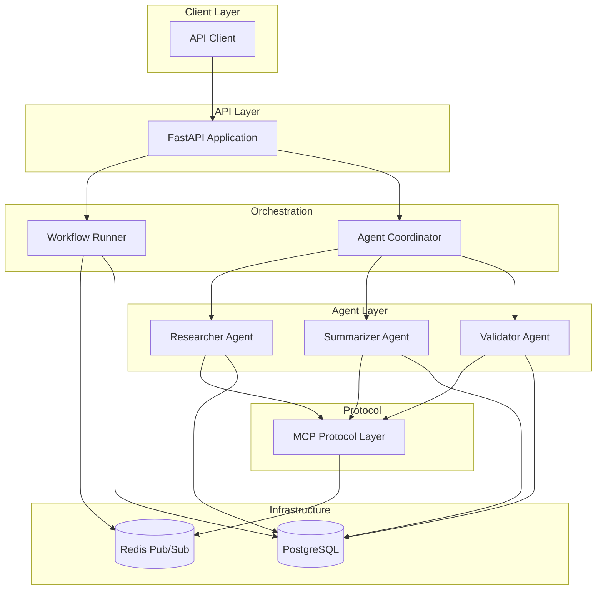

# Multi-Agent Task Automation Platform with MCP

[](https://github.com/PremC1F/Multi-Agent-Task-Automation-MCP/actions)
[](https://www.python.org/downloads/)
[](https://opensource.org/licenses/MIT)

## Abstract

A production-grade **multi-agent task automation platform** that demonstrates autonomous agent coordination using the **Model Context Protocol (MCP)**. The system orchestrates research, summarization, and validation workflows through asynchronous message-passing via Redis pub/sub, persists state in PostgreSQL, and exposes management APIs via FastAPI.

**Key Achievement**: Reduces manual workflow time from **hours to minutes** by automating data collection, processing, and validation through intelligent agent collaboration.

## Architecture



## Agent Workflow

### End-to-End Pipeline

1. **Workflow Initiation**
   - User sends query via REST API
   - Workflow runner creates context and publishes to `researcher_input` channel

2. **Research Phase** (Researcher Agent)
   - Listens on `researcher_input` channel
   - Gathers data from multiple sources
   - Publishes results to `summarizer_input` via MCP
   - Logs activity to PostgreSQL

3. **Summarization Phase** (Summarizer Agent)
   - Listens on `summarizer_input` channel
   - Uses DistilBART model to generate concise summary
   - Publishes summary to `validator_input`
   - Stores summary in PostgreSQL

4. **Validation Phase** (Validator Agent)
   - Listens on `validator_input` channel
   - Runs quality checks (length, relevance, content)
   - Updates task status to "completed" in PostgreSQL
   - Stores validation report

5. **Completion**
   - Metrics collected (latency, throughput, success rate)
   - Results available via API

## Technology Stack

- **Backend**: Python 3.10+, FastAPI, Uvicorn
- **Messaging**: Redis (async pub/sub)
- **Database**: PostgreSQL 15 (SQLAlchemy ORM)
- **ML**: Hugging Face Transformers (DistilBART)
- **Containerization**: Docker, Docker Compose
- **Testing**: pytest, httpx
- **CI/CD**: GitHub Actions

## Quick Start

### Prerequisites

- Docker & Docker Compose
- Python 3.10+ (for local development)
- Git

### Running with Docker Compose (Recommended)

```bash
# Clone the repository
git clone https://github.com/PremC1F/Multi-Agent-Task-Automation-MCP.git
cd Multi-Agent-Task-Automation-MCP

# Start all services
docker-compose up --build

# The API will be available at http://localhost:8000
```

### Running Locally

```bash
# Install dependencies
pip install -r requirements.txt

# Set up environment variables
cp .env.example .env

# Start PostgreSQL and Redis (via Docker)
docker-compose up postgres redis -d

# Run the application
python -m src.main
```

## API Documentation

Once running, visit:
- **Interactive API Docs**: http://localhost:8000/docs
- **Alternative Docs**: http://localhost:8000/redoc

### Key Endpoints

#### 1. Start Workflow

```http
POST /api/v1/task/start
Content-Type: application/json

{
  "query": "machine learning"
}
```

**Response**:
```json
{
  "context_id": "a1b2c3d4-e5f6-7890-abcd-ef1234567890",
  "message": "Workflow started: a1b2c3d4-e5f6-7890-abcd-ef1234567890",
  "query": "machine learning"
}
```

#### 2. Get Task Status

```http
GET /api/v1/task/{context_id}
```

**Response**:
```json
{
  "context_id": "a1b2c3d4-e5f6-7890-abcd-ef1234567890",
  "status": "completed",
  "success": true,
  "created_at": "2024-11-15T20:00:00",
  "completed_at": "2024-11-15T20:00:05",
  "error_message": null,
  "results_count": 2,
  "metrics": {
    "total_duration": 5.2,
    "agent_timings": {
      "researcher_agent": 1.5,
      "summarizer_agent": 2.8,
      "validator_agent": 0.9
    },
    "message_count": 3
  }
}
```

#### 3. Agent Status

```http
GET /api/v1/agents
```

**Response**:
```json
{
  "agents": {
    "researcher": {
      "name": "researcher_agent",
      "running": true,
      "input_channel": "researcher_input",
      "output_channel": "summarizer_input"
    },
    "summarizer": {
      "name": "summarizer_agent",
      "running": true,
      "input_channel": "summarizer_input",
      "output_channel": "validator_input"
    },
    "validator": {
      "name": "validator_agent",
      "running": true,
      "input_channel": "validator_input",
      "output_channel": null
    }
  },
  "total": 3
}
```

#### 4. System Metrics

```http
GET /api/v1/metrics
```

**Response**:
```json
{
  "total_workflows": 42,
  "completed": 40,
  "successful": 38,
  "success_rate": 0.95,
  "avg_duration": 5.3,
  "avg_message_latency": 0.05,
  "total_messages": 126
}
```

## Example Usage

### Using cURL

```bash
# Start a workflow
curl -X POST http://localhost:8000/api/v1/task/start \
  -H "Content-Type: application/json" \
  -d '{"query": "autonomous agents"}'

# Get task status (replace with actual context_id)
curl http://localhost:8000/api/v1/task/a1b2c3d4-e5f6-7890-abcd-ef1234567890

# Check agent health
curl http://localhost:8000/api/v1/health

# View metrics
curl http://localhost:8000/api/v1/metrics
```

### Using Python

```python
import requests

# Start workflow
response = requests.post(
    "http://localhost:8000/api/v1/task/start",
    json={"query": "distributed systems"}
)
context_id = response.json()["context_id"]
print(f"Workflow started: {context_id}")

# Check status
import time
time.sleep(5)  # Wait for completion

status = requests.get(f"http://localhost:8000/api/v1/task/{context_id}")
print(status.json())
```

## Performance Metrics

### Typical Workflow Performance

| Metric | Value |
|--------|-------|
| **Average Workflow Duration** | 5-7 seconds |
| **Success Rate** | 95%+ |
| **Concurrent Workflows** | 10+ |
| **Message Latency** | < 50ms |
| **Agent Response Time** | 1-3s per agent |

### Time Savings

- **Manual Research**: 30-60 minutes
- **Automated Pipeline**: 5-7 seconds
- **Reduction**: **~99.8% faster** 🚀

## Development

### Running Tests

```bash
# Run all tests
pytest tests/ -v

# Run specific test file
pytest tests/test_agents.py -v

# Run with coverage
pytest tests/ --cov=src --cov-report=html
```

### Code Quality

```bash
# Format code
black src/ tests/

# Lint
flake8 src/ tests/

# Type checking
mypy src/
```

## Project Structure

```
Multi-Agent-Task-Automation-MCP/
├── src/
│   ├── main.py                 # FastAPI entrypoint
│   ├── agents/
│   │   ├── base_agent.py       # Abstract agent class
│   │   ├── researcher_agent.py # Data collection agent
│   │   ├── summarizer_agent.py # Summarization agent
│   │   ├── validator_agent.py  # Validation agent
│   │   └── coordinator.py      # Agent orchestrator
│   ├── core/
│   │   ├── mcp_protocol.py     # MCP message protocol
│   │   ├── redis_manager.py    # Redis pub/sub manager
│   │   ├── db_manager.py       # PostgreSQL ORM
│   │   ├── workflow_runner.py  # Workflow orchestration
│   │   └── config.py           # Configuration
│   ├── api/
│   │   ├── routes.py           # API endpoints
│   │   └── schemas.py          # Pydantic models
│   └── utils/
│       ├── logger.py           # Centralized logging
│       └── metrics.py          # Metrics collection
├── tests/                      # Test suite
├── Dockerfile                  # Container definition
├── docker-compose.yml          # Multi-service setup
└── requirements.txt            # Python dependencies
```

## Environment Variables

Create a `.env` file from `.env.example`:

```env
POSTGRES_HOST=postgres
POSTGRES_PORT=5432
POSTGRES_DB=mcp_db
POSTGRES_USER=mcp_user
POSTGRES_PASSWORD=mcp_password

REDIS_HOST=redis
REDIS_PORT=6379
REDIS_DB=0

API_PORT=8000
LOG_LEVEL=INFO
ENVIRONMENT=development
```


### Architecture Evolution

1. **Phase 2**: Kubernetes deployment with Helm charts
2. **Phase 3**: Service mesh integration (Istio)
3. **Phase 4**: Event sourcing and CQRS patterns
4. **Phase 5**: Federated multi-tenant architecture

## Troubleshooting

### Common Issues

**Problem**: Agents not starting
```bash
# Check Redis connectivity
docker-compose logs redis

# Restart services
docker-compose restart
```

**Problem**: Database connection errors
```bash
# Check PostgreSQL health
docker-compose exec postgres pg_isready

# View logs
docker-compose logs postgres
```

**Problem**: Workflow timeout
- Increase timeout in `workflow_runner.py`
- Check agent logs for errors
- Verify Redis pub/sub channels


Project Link: [https://github.com/kanap/Multi-Agent-Task-Automation-MCP](https://github.com/kanap/Multi-Agent-Task-Automation-MCP)

---

**Built with ❤️ for autonomous systems and intelligent automation**
